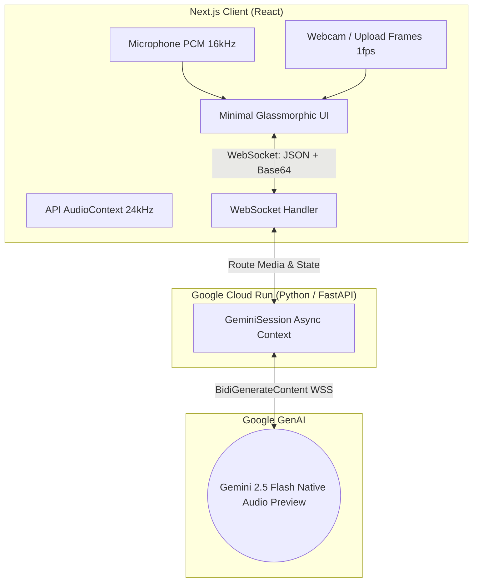

<div align="center">
  
  <h1>VisionTutor 👀🗣️</h1>
  <p><strong>An AI tutor that sees your notes, hears your questions, and responds in real-time.</strong></p>

  [](https://cloud.google.com/)
  [](https://ai.google.dev/)
  []()
</div>

---

## 🎯 Inspiration

Standard text-based LLMs are great for generating essays or fixing code, but when it comes to *studying*, students don't learn by typing out long, complex math equations or describing a physics diagram via text. 

We built **VisionTutor** to replicate the experience of sitting next to a real human tutor. We wanted an AI that you can point at your handwritten homework, ask a question out loud, and get an immediate, conversational response that you can interrupt at any time if you get confused.

## 💡 What it does

VisionTutor is a next-generation study application that moves far beyond standard text-based chat. By leveraging the new **Gemini Live API (WebSockets)** via the **Google GenAI Python SDK (v1.5.0)**, VisionTutor acts as a real-time multimodal conversational agent.

### 5 Core Features

| # | Feature | Description |
|---|---------|-------------|
| 1 | **🧠 Socratic Mode** | Guides you to the answer with leading questions instead of giving it away directly. Toggle it on in the UI. |
| 2 | **🔍 Mistake Detection** | Point your camera at your written work and click "Check My Work" — the AI scans every step and pinpoints exactly where you went wrong. |
| 3 | **❓ Follow-up Quiz** | After explaining any concept, the tutor automatically quizzes you verbally to lock in understanding. Always active. |
| 4 | **👣 Step-by-Step Walkthrough** | Solves problems one step at a time, pausing for your confirmation before continuing. Showcases natural barge-in. |
| 5 | **📝 Exam Mode** | Full mock exam experience — Gemini reads questions, you answer verbally, it scores you at the end with detailed feedback. |

### Other Capabilities
* **Multimodal Input**: Simultaneously accepts PCM audio from your microphone and video frames from your webcam.
* **Instant Voice Response**: The tutor speaks back using Gemini's native voice (`Kore` persona).
* **Natural Interruption**: Barge-in mid-sentence. The system detects "interrupted" signals and halts audio playback instantly.
* **Subject Context**: Switch between Maths, Physics, Chemistry, CS, Biology for tailored tutoring styles.

---

## 🏗️ Architecture & How we built it



### Tech Stack Details
* **Backend (Python/FastAPI)**: We used the newly released `google-genai` (v1.5.0) SDK to establish a continuous bidirectional WebSocket connection using `client.aio.live.connect()`. FastAPI acts as a proxy to isolate frontend clients from the model context.
* **Frontend (Next.js/React)**: Features a custom Glassmorphic UI with animated aurora backgrounds. We utilized the core Web Audio API to capture raw 16kHz float32 arrays from the microphone, convert them to Int16 PCM, and schedule 24kHz audio buffers returned from Gemini perfectly seamlessly.
* **Google Cloud Setup**: The entire backend is containerized using Docker and deployed to a fully managed **Google Cloud Run** instance (`visiontutar-357243848387.europe-west1.run.app`).

---

## 🧠 Challenges we ran into

1. **SDK Versioning & API Thrash:** Google’s new `google-genai` pip package changed rapidly. We had to migrate quickly from older `genai.chat` patterns to the experimental `client.aio.live.connect()` Async Context Managers required by SDK v1.5.0.
2. **Method Hunting:** In version 1.5.0, older helper methods like `send_realtime_input` were condensed into a unified `send(input=types.LiveClientRealtimeInput(...))` function, which blocked us for hours before investigating the SDK source code directly to find the new Pydantic models.
3. **Audio Synthesis Rendering Gaps:** While receiving PCM audio chunks from Gemini, putting them through a simple `onended` queue caused robotic stuttering due to the JavaScript Event Loop block gap. We had to implement a seamless Web Audio API scheduling mechanism (`nextPlayTimeRef`) to perfectly buffer chunks ahead of the browser's audio clock, making Gemini's voice flow smoothly!
4. **Context Manager Garbage Collection:** Initially, the FastAPI websocket would instantly close after connecting. We discovered that because we only saved the `session` object, Python's garbage collector was killing the `_ctx_manager` and triggering an `__aexit__()` closure on the Live API!

---

## 🚀 How to Run Locally

If you are a judge or developer wishing to test the application locally, follow these steps:

### Prerequisites
* **Python 3.10+**
* **Node.js 18+**
* An active **Gemini API Key**

### 1. Start the Backend
```bash
cd backend
python -m venv .venv
source .venv/bin/activate  # Or `.venv\Scripts\activate` on Windows
pip install -r requirements.txt

# Set your API Key
export GEMINI_API_KEY="AIzaSy..."  

# Start the server (runs on port 8000)
uvicorn app.main:app --reload --host 0.0.0.0 --port 8000
```

### 2. Start the Frontend
Open a new terminal tab:
```bash
cd frontend
npm install

# Optional: If you want to connect to your local backend instead of the Cloud Run instance
# change NEXT_PUBLIC_BACKEND_WS_URL in .env.local to ws://localhost:8000/ws/session

npm run dev
```

Visit **`http://localhost:3000`** in Google Chrome or Edge. Ensure you allow Microphone and Camera permissions when prompted!

---

## ☁️ Google Cloud Deployment (Bonus Objective)

Our project meets the **Hackathon Bonus Points** requirement by automating cloud deployment via Infrastructure-as-code scripts!

The backend includes a `Dockerfile` and an automated PowerShell deployment script (`deploy-backend.ps1`) which executes:
1. `gcloud builds submit` to containerize the Python app.
2. `gcloud run deploy` to automatically push it to our Cloud Run endpoint.
3. Securely mounts the `VISIONTUTOR_GEMINI_API_KEY` straight from Google Secret Manager.

## 🔮 What's next for VisionTutor
* **Session Memory & Firestore Integration:** Saving whiteboard sessions and transcripts into a database so students can review past tutoring sessions.
* **Canvas Drawing Mode:** Allowing the student to actually draw math equations on their screen using their mouse/stylus instead of just showing paper to the webcam.
* **Smarter End-of-Turn Detection:** Further tuning the Voice Activity Detection (VAD) alongside the Gemini `interrupted` flag for a tighter conversation loop.
